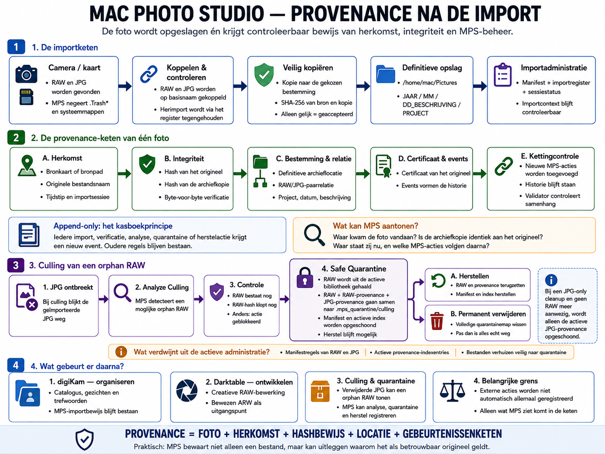

# Provenance in Mac Photo Studio



**Actuele kaartversie:** v2

**Bijgewerkt:** 2026-08-06

## 1. Wat provenance hier betekent

Mac Photo Studio (MPS) slaat niet alleen een foto op. Het legt ook controleerbaar
vast wat het zelf rond die foto heeft gezien, uitgevoerd en gevalideerd:

- waar het bestand vandaan kwam;
- welke bestandsnaam en importcontext bekend waren;
- of de archiefkopie byte-voor-byte overeenkwam met de bron;
- waar het bestand werd opgeslagen;
- welke latere MPS-acties zijn vastgelegd;
- of de onderdelen van die administratie nog met elkaar samenhangen.

Daarmee kan MPS onderbouwen wat het zelf heeft waargenomen en gecontroleerd. Het
doet geen absolute juridische uitspraak en bewijst ook niet wat buiten MPS is
gebeurd.

## 2. De importketen

MPS detecteert RAW- en JPG-bestanden en negeert `.Trash*` en andere duidelijke
systeem- en prullenbakmappen. RAW en JPG worden op basis van hun bestandsnaam
zonder extensie aan elkaar gekoppeld. Bescherming tegen ongewenste herimport
voorkomt dat eerder verwerkte bestanden ongemerkt opnieuw in het archief komen.

Bestanden worden veilig gekopieerd. Daarna vergelijkt MPS de SHA-256-hash van de
bron met die van de kopie. Pas na een geslaagde kopie én checksumcontrole is een
bestand `VERIFIED`.

De huidige opslagstructuur is:

```text
PHOTOS_ROOT / YEAR / MM / DD[_DESCRIPTION] / PROJECT
```

Het importmanifest, het importregister en de sessiecontext leggen samen vast wat
in de importsessie is verwerkt, waar het terechtkwam en welke context daarbij
hoorde.

## 3. Provenance per foto

Per foto verbindt MPS de volgende gegevens:

- **herkomst:** het bekende bronbestand en de importcontext;
- **integriteit:** de gecontroleerde SHA-256-identiteit;
- **bestemming en RAW/JPG-relatie:** de archieflocatie en de samenhang van het
  fotopaar;
- **certificaat:** de vastgelegde identiteit en ingestgegevens;
- **events:** latere acties die MPS aan de historie toevoegt;
- **kettingcontrole:** verificatie dat identiteit, bestanden en geregistreerde
  gebeurtenissen onderling blijven aansluiten.

De historie werkt als een append-only kasboek: een nieuwe MPS-actie voegt een
nieuwe regel aan de geschiedenis toe. Eerder geregistreerde historie wordt niet
stilzwijgend vervangen. Zo blijft zichtbaar welke stappen MPS achtereenvolgens
heeft vastgelegd.

## 4. Orphan RAW en Safe Quarantine

Wanneer de JPG ontbreekt, kan een RAW-bestand een mogelijke orphan RAW zijn. MPS
controleert eerst of de RAW nog bestaat en of de RAW-hash nog klopt. Alleen dan
kan Safe Quarantine volgen:

```text
JPG ontbreekt
→ mogelijke orphan RAW
→ RAW bestaat nog
→ RAW-hash klopt nog
→ Safe Quarantine
→ herstellen of permanent verwijderen
```

MPS blokkeert de actie als de JPG inmiddels terug is of als de RAW-hash is
gewijzigd. Ook eist MPS exact het verwachte aantal regels in manifest en
provenance-index. Een al bestaande quarantainebestemming is eveneens een reden
om te stoppen. Vóór de verplaatsing bewaart MPS snapshots van het manifest en de
provenance-index.

Bij een normaal RAW+JPG-paar gaan de bijbehorende onderdelen samen naar:

```text
.mps_quarantine/culling/<fotonaam>/
```

Daar worden bewaard:

- de RAW;
- het RAW-certificaat en de RAW-events;
- het JPG-certificaat en de JPG-events;
- quarantainemetadata;
- snapshots van manifest en provenance-index.

De betreffende RAW- en JPG-manifestregels verdwijnen uit de actieve
administratie. Ook de bijbehorende actieve provenance-indexentries worden
verwijderd. Herstel zet bestanden, manifestregels en indexentries transactioneel
terug. Permanent verwijderen wist pas daarna de volledige quarantainemap en mag
alleen binnen `.mps_quarantine/culling` plaatsvinden.

Bij JPG-only cleanup zonder aanwezige RAW wordt alleen de actieve
JPG-provenance opgeschoond.

**De RAW wordt niet onmiddellijk vernietigd. Hij wordt eerst samen met de
bijbehorende RAW- en JPG-provenance veilig uit de actieve bibliotheek naar
quarantaine verplaatst.**

## 5. Wat gebeurt er daarna?

- **digiKam** verzorgt catalogusbeheer, gezichten, trefwoorden en organisatie.
- **darktable** verzorgt de ontwikkeling van RAW-bestanden.
- **MPS** blijft verantwoordelijk voor zijn analyse, quarantine, herstel en
  verificatie.

## 6. Belangrijke grens

Externe acties worden niet automatisch allemaal geregistreerd. Alleen wat MPS
ziet, uitvoert of valideert kan betrouwbaar deel van de MPS-keten worden.
Provenance is dus controleerbare MPS-administratie, geen magische registratie
van alles wat ooit buiten MPS gebeurde.

## 7. Kaartversies

[Versiehistorie van de provenancekaart](CHANGELOG.md)
